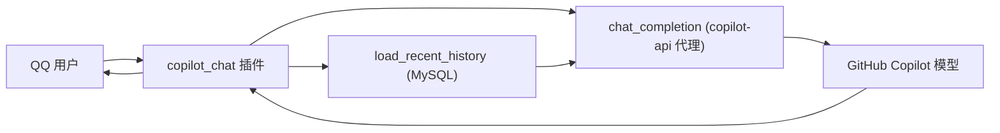

# Copilot 对话插件使用说明

`copilot_chat` 插件让 QQ 机器人通过本地 [copilot-api](https://github.com/ericc-ch/copilot-api) 代理与 GitHub Copilot 模型对话，并自动带入最近的聊天历史作为上下文。

## 工作原理



1. 用户在私聊或群聊中触发对话。
2. 插件用 `session_id` 从 MySQL 读取最近的历史消息。
3. 拼装 `system + 历史 + 当前消息` 的消息列表，POST 到 copilot-api 代理。
4. 把模型回复发回给用户。

## 前置条件

1. **启动 copilot-api 代理**（暴露 Copilot 为 OpenAI 兼容接口，默认端口 `4141`）：

   ```bash
   npx copilot-api@latest start
   ```

   首次运行会引导你完成 GitHub 授权。可用 `npx copilot-api@latest debug` 检查授权状态。

2. **准备 MySQL**（用于保存与读取聊天历史），并在环境变量里配置连接信息。

3. **运行 OneBot 实现**（如 napcat），并与机器人通过 WebSocket 连接。

## 环境配置

在 `.env`（或 `.env.<environment>`）中配置以下变量：

```dotenv
# Copilot 对话 API 配置
COPILOT_API_URL=http://127.0.0.1:4141/v1/chat/completions
COPILOT_MODEL=gpt-4o
COPILOT_TIMEOUT=60
COPILOT_MAX_TURNS=10
COPILOT_SYSTEM_PROMPT=""

# MySQL 配置
MYSQL_HOST=127.0.0.1
MYSQL_PORT=3306
MYSQL_USER=your_user
MYSQL_PASSWORD=your_password
MYSQL_DATABASE=qq_copilot_bot
```

| 变量 | 说明 | 默认值 |
| --- | --- | --- |
| `COPILOT_API_URL` | copilot-api 代理的聊天补全地址 | `http://127.0.0.1:4141/v1/chat/completions` |
| `COPILOT_MODEL` | 使用的模型名（可用 `/v1/models` 查询可用列表） | `gpt-4o` |
| `COPILOT_TIMEOUT` | 单次请求超时（秒） | `60` |
| `COPILOT_MAX_TURNS` | 带入上下文的最大轮数（实际读取约 `2 * MAX_TURNS` 条消息） | `10` |
| `COPILOT_SYSTEM_PROMPT` | 系统提示词，为空则不添加 | 空 |

> 注意：变量名是 `COPILOT_API_URL`（单个 `L`）。请确保 `.env` 中拼写一致，否则配置不会生效。

## 启动机器人

```bash
uv sync
uv run nb run --reload
```

## 使用方式

插件提供两种触发入口：

### 1. 显式命令

在私聊或群聊中发送命令，内容跟在命令后面：

```text
/chat 帮我写一段快速排序
/问 今天的天气适合做什么
/ai 解释一下什么是闭包
```

- 命令别名：`chat`、`问`、`ai`。
- 命令前缀由 `COMMAND_START` 控制（默认包含 `/` 和空前缀）。

### 2. 隐式触发（@机器人 / 私聊）

- **私聊**：直接发送任意文字即可对话，无需命令。
- **群聊**：`@机器人` 并附上内容，例如 `@QQ Copilot Bot 这段代码哪里有问题`。

如果消息内容为空，机器人会提示：`请在消息中附上要对话的内容~`。

## 上下文与会话隔离

- 历史按 `session_id` 隔离：
  - 群聊：`group:<group_id>`（同一群共享上下文）。
  - 私聊：`private:<user_id>`（每个用户独立）。
- 每次对话最多带入 `2 * COPILOT_MAX_TURNS` 条历史消息，按时间从旧到新排列。
- 历史由 `message_recorder` 插件写入 MySQL，`copilot_chat` 负责读取。

## 常见问题

| 现象 | 可能原因 | 处理 |
| --- | --- | --- |
| `⚠️ 对话失败：请求失败: ...` | 代理未启动或地址错误 | 确认 copilot-api 在 `4141` 运行，核对 `COPILOT_API_URL` |
| `⚠️ 对话失败：... HTTP 502` | 代理已启动但上游 Copilot 授权失效 | 运行 `npx copilot-api@latest debug` 重新授权 |
| `⚠️ 对话失败：... HTTP 404` | 模型名无效 | 用 `/v1/models` 查询可用模型并更新 `COPILOT_MODEL` |
| `模型未返回内容` | 模型返回空回复 | 重试或更换模型 |
| 机器人无响应 | 未 `@` 或命令前缀不匹配 | 私聊直接发送，群聊需 `@机器人` 或使用 `/chat` |

## 相关端点（可选）

copilot-api 代理还提供以下监控端点，代码中已封装对应客户端函数：

| 端点 | 客户端函数 | 用途 |
| --- | --- | --- |
| `GET /v1/models` | `list_models()` | 列出可用模型 |
| `GET /token` | `get_token()` | 查看当前使用的 Copilot token |
| `GET /usage` | `get_usage()` | 查看用量与配额统计 |

函数位于 `src/qq_copilot_bot/services/copilot/copilot_service.py`，示例：

```python
from qq_copilot_bot.services.copilot.copilot_service import list_models

models = await list_models()
```
